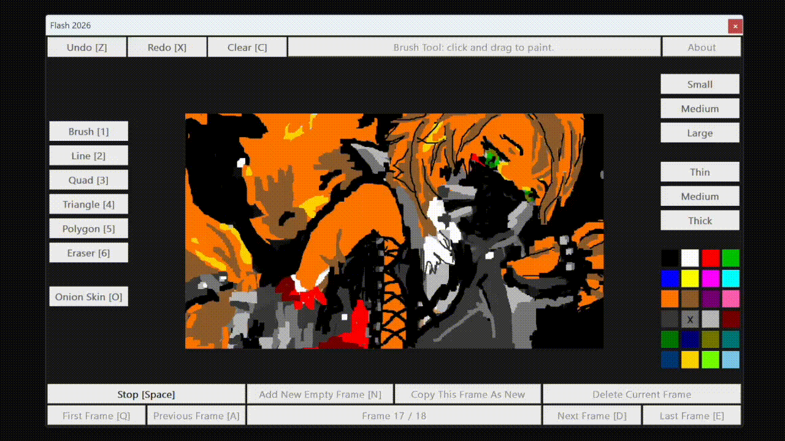

# Flash-2026
A zero dependency Win32 OpenGL Flash clone in one C++ file for nostalgia and learning. Flash (Animate) has long been a creative tool, and recent news of its sunset motivated this small clone. Running it is intentionally simple. A standard Windows machine with Visual Studio can build the single `Main.cpp` file. The demo below recreates Pulchra from Zenless Zone Zero as a small fan piece. The workflow stays light, but saving is not supported—an echo of impermanence.

